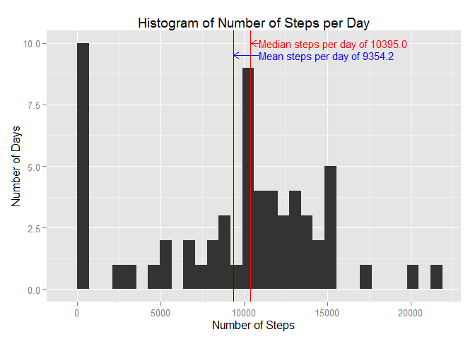
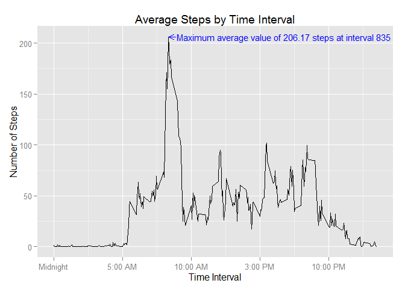
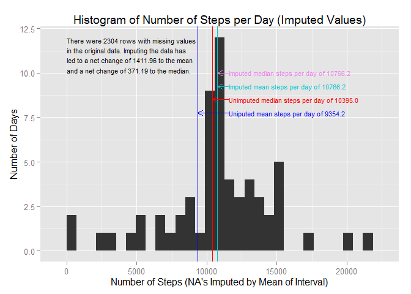
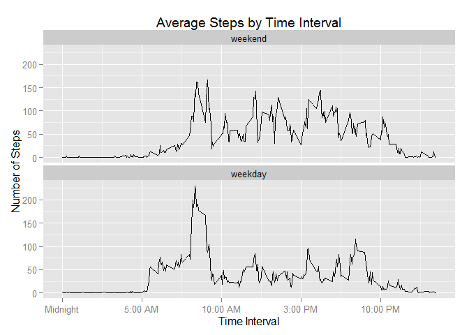

# Reproducible Research: Peer Assessment 1

## Load required libraries

```r
library(dplyr)
```

```
## 
## Attaching package: 'dplyr'
## 
## The following object is masked from 'package:stats':
## 
##     filter
## 
## The following objects are masked from 'package:base':
## 
##     intersect, setdiff, setequal, union
```

```r
library(ggplot2)
library(grid)
```

## Initial setup

```r
## Only required once, comment out to expedite development

## if(!(file.exists("./data") & file.info("./data")$isdir)) dir.create("./data")
## download.file(
##     "https://d396qusza40orc.cloudfront.net/repdata%2Fdata%2Factivity.zip"
##     ,destfile = "./data/repdata_data_activity.zip"
## )
## write(date(), file = "./data/date_downloaded.txt")
## unzip("./data/repdata_data_activity.zip", exdir = "./data")
## file.remove("./data/repdata_data_activity.zip")
```

## Loading and preprocessing the data

```r
## Show any code that is needed to
## 1. Load the data (i.e. read.csv())
## 2. Process/transform the data (if necessary) into a format suitable for your
## analysis

data <- read.csv("./data/activity.csv")
data$date <- as.Date(data$date, "%Y-%m-%d")
```

## What is mean total number of steps taken per day?

```r
## Calculate the total number of steps taken per day

stepsByDate <- data %>% group_by(date) %>% summarize(sum(steps, na.rm = T))
names(stepsByDate) = c("date", "steps")

## Make a histogram of the total number of steps taken each day
## Calculate and report the mean and median of the total number of steps taken
## per day

plot1 <- qplot(
    stepsByDate$steps
    ,geom = "histogram"
    ,binwidth = (range(stepsByDate$steps)[2] - range(stepsByDate$steps)[1]) / 30
    ,main = "Histogram of Number of Steps per Day"
    ,xlab = "Number of Steps"
    ,ylab = "Number of Days"
) +
geom_vline( # median line
    xintercept = median(stepsByDate$steps)
    ,color = "red"
) +
geom_segment( # median arrow
    aes(
        x = median(stepsByDate$steps) + 5
        ,xend = median(stepsByDate$steps) + 495
        ,y = 10
        ,yend = 10
    )
    ,color = "red"
    ,arrow = arrow(length = unit(.1,"in"), ends = "first")    
) +
geom_text( # median label
    aes(
        x = median(stepsByDate$steps) + 500
        ,y = 10
        ,label = paste(
            "Median steps per day of"
            ,sprintf("%.1f", median(stepsByDate$steps))
        )
    )
    ,color = "red"
    ,size = 4
    ,hjust = 0
) +
geom_vline( # mean line
    xintercept = mean(stepsByDate$steps)
    ,color = "blue"
) +
geom_segment( # mean arrow
    aes(
        x = mean(stepsByDate$steps) + 5
        ,xend = median(stepsByDate$steps) + 495
        ,y = 9.5
        ,yend = 9.5
    )
    ,color = "blue"
    ,arrow = arrow(length = unit(.1,"in"), ends = "first")    
) +
geom_text( # mean label
    aes(
        x = median(stepsByDate$steps) + 500
        ,y = 9.5
        ,label = paste(
            "Mean steps per day of"
            ,sprintf("%.1f", mean(stepsByDate$steps))
        )
    )
    ,color = "blue"
    ,size = 4
    ,hjust = 0
)
print(plot1)
```

 

## What is the average daily activity pattern?

```r
## Make a time series plot (i.e. type = "l") of the 5-minute interval (x-axis)
## and the average number of steps taken, averaged across all days (y-axis)
## Which 5-minute interval, on average across all the days in the dataset,
## contains the maximum number of steps?

stepsByInterval <- data %>%
    group_by(interval) %>%
    summarize(mean(steps, na.rm = T))
names(stepsByInterval) = c("interval", "steps")
plot2 <- ggplot(
    stepsByInterval
    ,aes(
        x = interval
        ,y = steps
    )
) +
geom_line() +
scale_x_continuous(
    breaks = c(0,500,1000,1500,2000)
    ,labels = c("Midnight", "5:00 AM", "10:00 AM", "3:00 PM", "10:00 PM")
) +
geom_segment( # max arrow
    aes(
        x = stepsByInterval[[
            which.max(stepsByInterval$steps), "interval"
        ]] + 5
        ,xend = stepsByInterval[[
            which.max(stepsByInterval$steps), "interval"
        ]] + 55
        ,y = max(stepsByInterval$steps)
        ,yend = max(stepsByInterval$steps)
    )
    ,color = "blue"
    ,arrow = arrow(length = unit(.1,"in"), ends = "first")    
) +
annotate( # max label
    "text"
    ,x = stepsByInterval[[
        which.max(stepsByInterval$steps), "interval"
    ]] + 60
    ,y = max(stepsByInterval$steps)
    ,label = paste("Maximum average value of"
        ,sprintf("%.2f", max(stepsByInterval$steps))
        ,"steps at interval"
        ,stepsByInterval[[which.max(stepsByInterval$steps), "interval"]]
    )
    ,color = "blue"
    ,size = 4
    ,hjust = 0
) +
labs(
    title = "Average Steps by Time Interval"
    ,x = "Time Interval"
    ,y = "Number of Steps"
)
print(plot2)
```

 

## Imputing missing values

```r
## Calculate and report the total number of missing values in the dataset
## (i.e. the total number of rows with NAs)

message(
    paste(
        "There are"
        ,sum(! complete.cases(data))
        ,"rows with missing values in the data."
    )
)
```

```
## There are 2304 rows with missing values in the data.
```

```r
## Devise a strategy for filling in all of the missing values in the dataset.
## The strategy does not need to be sophisticated. For example, you could use
## the mean/median for that day, or the mean for that 5-minute interval, etc.
```
The stepsByInterval tbl_df contains the mean of each interval across the
data set excluding "NA" values.  Impute any NA values with the mean within the
corresponding interval in stepsByInterval.


```r
## Create a new dataset that is equal to the original dataset but with the
## missing data filled in.

imputedData <- data

for (i in 1:nrow(imputedData)){
    if (is.na(imputedData[[i,"steps"]])){
        imputedData[[i,"steps"]] <- as.numeric(
            filter(
                stepsByInterval
                ,interval == imputedData[[i,"interval"]]
            ) %>% select(steps)
        )
    }
}

## Make a histogram of the total number of steps taken each day and Calculate
## and report the mean and median total number of steps taken per day. Do these
## values differ from the estimates from the first part of the assignment? What
## is the impact of imputing missing data on the estimates of the total daily
## number of steps?

iStepsByDate <- imputedData %>% 
    group_by(date) %>% 
    summarize(sum(steps, na.rm = T))
names(iStepsByDate) = c("date", "steps")

plot3 <- qplot(
    iStepsByDate$steps
    ,geom = "histogram"
    ,binwidth = (range(iStepsByDate$steps)[2] - range(iStepsByDate$steps)[1])/30
    ,main = "Histogram of Number of Steps per Day (Imputed Values)"
    ,xlab = "Number of Steps (NA's Imputed by Mean of Interval)"
    ,ylab = "Number of Days"
) +
geom_vline( # median line
    xintercept = median(iStepsByDate$steps)
    ,color = "violet"
) +
geom_segment( # median arrow
    aes(
        x = median(iStepsByDate$steps) + 5
        ,xend = median(iStepsByDate$steps) + 795
        ,y = 10
        ,yend = 10
    )
    ,color = "violet"
    ,arrow = arrow(length = unit(.1,"in"), ends = "first")    
) +
geom_text( # median label
    aes(
        x = median(iStepsByDate$steps) + 800
        ,y = 10
        ,label = paste(
            "Imputed median steps per day of"
            ,sprintf("%.1f", median(iStepsByDate$steps))
        )
    )
    ,color = "violet"
    ,size = 3
    ,hjust = 0
) +
geom_vline( # mean line
    xintercept = mean(iStepsByDate$steps)
    ,color = "turquoise3"
) +
geom_segment( # mean arrow
    aes(
        x = mean(iStepsByDate$steps) + 5
        ,xend = median(iStepsByDate$steps) + 795
        ,y = 9.25
        ,yend = 9.25
    )
    ,color = "turquoise3"
    ,arrow = arrow(length = unit(.1,"in"), ends = "first")    
) +
geom_text( # mean label
    aes(
        x = median(iStepsByDate$steps) + 800
        ,y = 9.25
        ,label = paste(
            "Imputed mean steps per day of"
            ,sprintf("%.1f", mean(iStepsByDate$steps))
        )
    )
    ,color = "turquoise3"
    ,size = 3
    ,hjust = 0
) +
geom_vline( # unimputed median line
    xintercept = median(stepsByDate$steps)
    ,color = "red"
) +
geom_segment( # unimputed median arrow
    aes(
        x = median(stepsByDate$steps) + 5
        ,xend = median(iStepsByDate$steps) + 795
        ,y = 8.5
        ,yend = 8.5
    )
    ,color = "red"
    ,arrow = arrow(length = unit(.1,"in"), ends = "first")    
) +
geom_text( # unimputed median label
    aes(
        x = median(iStepsByDate$steps) + 800
        ,y = 8.5
        ,label = paste(
            "Unimputed median steps per day of"
            ,sprintf("%.1f", median(stepsByDate$steps))
        )
    )
    ,color = "red"
    ,size = 3
    ,hjust = 0
) +
geom_vline( # unimputed mean line
    xintercept = mean(stepsByDate$steps)
    ,color = "blue"
) +
geom_segment( # unimputed mean arrow
    aes(
        x = mean(stepsByDate$steps) + 5
        ,xend = median(iStepsByDate$steps) + 795
        ,y = 7.75
        ,yend = 7.75
    )
    ,color = "blue"
    ,arrow = arrow(length = unit(.1,"in"), ends = "first")    
) +
geom_text( # unimputed mean label
    aes(
        x = median(iStepsByDate$steps) + 800
        ,y = 7.75
        ,label = paste(
            "Uniputed mean steps per day of"
            ,sprintf("%.1f", mean(stepsByDate$steps))
        )
    )
    ,color = "blue"
    ,size = 3
    ,hjust = 0
) +
geom_text( # Explanation
    aes(
        x = 0
        ,y = 11
        ,label = paste(
            "There were"
            ,sum(! complete.cases(data))
            ,"rows with missing values \nin the original data."
            ,"Imputing the data has \nled to a net change of"
            ,sprintf("%.2f", mean(iStepsByDate$steps) - mean(stepsByDate$steps))
            ,"to the mean \nand a net change of"
            ,sprintf("%.2f", median(
                iStepsByDate$steps) - median(stepsByDate$steps)
            )
            ,"to the median."
        )
    )
    ,color = "black"
    ,size = 3
    ,hjust = 0
)    
print(plot3)
```

 

## Are there differences in activity patterns between weekdays and weekends?

```r
## Create a new factor variable in the dataset with two levels – “weekday” and
## “weekend” indicating whether a given date is a weekday or weekend day.
imputedData$dayType <- factor(
    ifelse(weekdays(imputedData$date) %in% c("Saturday", "Sunday")
           ,"weekend"
           ,"weekday"
    )
    ,levels = c("weekend", "weekday")
)

## Make a panel plot containing a time series plot (i.e. type = "l") of the
## 5-minute interval (x-axis) and the average number of steps taken, averaged
## across all weekday days or weekend days (y-axis). See the README file in the
## GitHub repository to see an example of what this plot should look like using
## simulated data.

iStepsByDateType <- imputedData %>% 
    group_by(interval, dayType) %>% 
    summarize(mean(steps))
names(iStepsByDateType) = c("interval", "dayType", "steps")

plot4 <- ggplot(
    iStepsByDateType
    ,aes(
        x = interval
        ,y = steps
    )
) +
geom_line() +
facet_wrap(~ dayType, ncol = 1) +
scale_x_continuous(
    breaks = c(0,500,1000,1500,2000)
    ,labels = c("Midnight", "5:00 AM", "10:00 AM", "3:00 PM", "10:00 PM")
) +
labs(
    title = "Average Steps by Time Interval"
    ,x = "Time Interval"
    ,y = "Number of Steps"
)
print(plot4)
```

 
