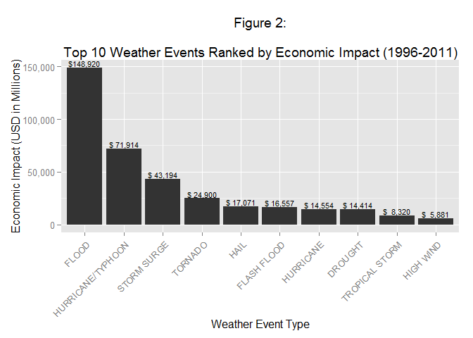
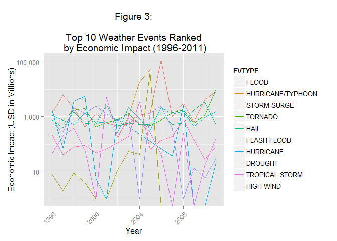

# NOAA Storm Events Database Analysis
### An Analysis of Weather Events and Their Impact on <br />Human Health and Economics in the United States

## Synopsis
This document represents an analysis of the National Oceanic and Atmospheric
Administration (NOAA) Storm Events Database. As described on the
Storm Events Database homepage[1], this database documents information from
storms or significant weather phenommena resulting in human casualties (i.e.
injuries or death), property damage, disruption to commerce, media attention
and/or significant meteorological events (e.g. record temperatures or
precipitation).  This analysis focuses on the weather events that are most
harmful with respect to human health and result in the greatest economic
consequences.

## Data Processing

#### Load Required Libraries

```r
library(ggplot2)    # Plotting (qplot)
library(grid)       # Plotting (grid.arrange)
library(gridExtra)  # Plotting (grid.arrange)
library(scales)     # Number formatting (labels = comma)
library(dplyr)      # Data manipulation (filter, mutate, group_by, etc.)
```

#### Initial Setup

```r
## if(!(file.exists("./data") & file.info("./data")$isdir)) dir.create("./data")
## download.file(
##     paste0("https://d396qusza40orc.cloudfront.net/"
##            ,"repdata%2Fdata%2FStormData.csv.bz2"
##     )
##     ,destfile = "./data/repdata_data_FStormData.csv.bz2"
## )
## write(date(), file = "./data/date_downloaded.txt")
```
This code block creates a subdirectory for the data, downloads the data and
creates a file to document the time the data was acquired.  It is commented out
to be used as an example only.

#### Loading and Preprocessing the Data

```r
data <- read.csv(bzfile("./data/repdata_data_FStormData.csv.bz2"))
data$date <- as.Date(data$BGN_DATE, "%m/%d/%Y")
data$year <- as.integer(substr(data$date,1,4))
data <- filter(data, date > "1996-01-01")
data$damage = 0

data[data$PROPDMGEXP == "K",] <- data %>% 
    filter(PROPDMGEXP == "K") %>%
	mutate(damage = damage + PROPDMG * 1e3)
data[data$PROPDMGEXP == "M",] <- data %>% 
	filter(PROPDMGEXP == "M") %>%
	mutate(damage = damage + PROPDMG * 1e6)
data[data$PROPDMGEXP == "B",] <- data %>% 
	filter(PROPDMGEXP == "B") %>%
	mutate(damage = damage + PROPDMG * 1e9)
data[data$CROPDMGEXP == "K",] <- data %>% 
	filter(CROPDMGEXP == "K") %>%
	mutate(damage = damage + CROPDMG * 1e3)
data[data$CROPDMGEXP == "M",] <- data %>% 
	filter(CROPDMGEXP == "M") %>%
	mutate(damage = damage + CROPDMG * 1e6)
data[data$CROPDMGEXP == "B",] <- data %>% 
	filter(CROPDMGEXP == "B") %>%
	mutate(damage = damage + CROPDMG * 1e9)

data <- mutate(data, casualties = FATALITIES + INJURIES)
```
This code block loads the data and executes several preprocessing steps to
facilitate subsequent analysis.  Preprocessing steps include:  

- Creating a variable (*date*) by coercing the *BGN_DATE* column to the Date
class.

- Creating a variable (*year*) derived from *date* to facilitate plotting.

- Excluding data prior to 1996 via the filter function.  This is motivated by
information conveyed on the Storm Event Database details page[2] which states
that data prior to 1996 only contain a subset of the 48 event types that have
been documented in the subsequent data (1996 to current).  By excluding data
prior to 1996 the analysis ensures equal consideration for all event types.

- Creating a singe variable (*damage*) to quantify economic impact resulting
from damage or loss to private property, public infrastructure and crops.
Damage estimates are represented within the data in the variables *PROPDMG*
(Property Damage), *PROPDMGEXP* (Property Damage Exponent), *CROPDMG* (Crop
Damage) and *CROPDMGEXP* (Crop Damage Exponent).  Per Section 2.7 of the NWS
Directive 10-1605[3],

> Estimates should be rounded to three significant digits, followed by an
alphabetical character signifying the magnitude of the number, i.e., 1.55B for
$1,550,000,000. Alphabetical characters used to signify magnitude include “K”
for thousands, “M” for millions, and “B” for billions. If additional precision
is available, it may be provided in the narrative part of the entry.  

- The *PROPDMG* and *CROPDMG* variables are of class numeric and do not contain
NAs, generally following the "three significant digits" guidance as cited above.
However, the *PROPDMGEXP* and *CROPDMGEXP* variables contain some observations
outside of the expected values "K", "M" and "B."  For this analysis the *damage*
variable represents the sum of the values expressed in the aforementioned
damage variables for each observation where exponents are in the expected values
set. Thus, each observation of *damage* will be the sum of (*PROPDMG* * 
*PROPDMGEXP*) and (*CROPDMG* * *CROPDMGEXP*) for each observation where
*PROPDMGEXP* or *CROPDMGEXP* is "K", "M" or "B."  Exponent values with
unexpected values and any additional information contained in *REMARKS* are
ignored (not calculated in *damage*).

- Creating a variable (*casualties*) to summate values from the *FATALITIES* and
*INJURIES* variables.  FUrther information about fatalities and injuries is
located in Section 2.6 of the NWS Directive 10-1605[3].

## Results

```r
## 1. Across the United States, which types of events (as indicated in the 
## EVTYPE variable) are most harmful with respect to population health?

cData <- data %>% 
    group_by(EVTYPE) %>% 
    summarize(casualties = sum(casualties)) %>%
    arrange(desc(casualties)) %>%
    top_n(10, casualties)

cData$EVTYPE <- factor(cData$EVTYPE, levels = cData$EVTYPE)

plot1 <- qplot(
    EVTYPE
    ,casualties
    ,data = cData
    ,geom = c("bar")
    ,stat = "identity"
    ,main = paste(
        "Figure 1:\nTop 10 Weather Events Ranked"
        ,"by Human Casualties (1996-2011)"
    )
    ,xlab = "Weather Event Type"
    ,ylab = "Human Casualties (Fatalities/Injuries)"
) + 
    theme(axis.text.x = element_text(angle = 45, hjust = 1)) +
    geom_text(
        aes(
            label = format(cData$casualties, big.mark = ",")
            ,vjust = -.5
        )
        ,size = 3
    )

print(plot1)
```

 

Figure 1 plots the top 10 weather event types ranked by the human casualties
(fatalities and injuries) inflicted by them in the United States from 1996-2011
as described in the *Data Processing* section above. The top two ranking weather
event types (TORNADO and EXCESSIVE HEAT) outweigh the casualties caused by the
trailing eight weather event types combined.


```r
## 2. Across the United States, which types of events have the greatest economic
## consequences?

eData <- data %>% 
    group_by(EVTYPE) %>% 
    summarize(damage = sum(damage)) %>%
    arrange(desc(damage)) %>%
    top_n(10, damage)

eData$EVTYPE <- factor(eData$EVTYPE, levels = eData$EVTYPE)

plot2 <- qplot(
    EVTYPE
    ,round(damage / 1e+06)
    ,data = eData
    ,geom = "bar"
    ,stat = "identity"
    ,main = 
        "Figure 2:\nTop 10 Weather Events Ranked by Economic Impact (1996-2011)"
    ,xlab = "Weather Event Type"
    ,ylab = "Economic Impact (USD in Millions)"
) + 
    theme(axis.text.x = element_text(angle = 45, hjust = 1)) +
    geom_text(
        aes(
            label = paste0(
                "$"
                ,format(round(eData$damage/1e+06), big.mark = ",")
            )
            ,vjust = -.5
        )
        ,size = 3
    ) +
    scale_y_continuous(labels = comma)

print(plot2)
```

 

Figure 2 plots the top 10 weather event types ranked by their total economic
impact in the United States from 1996-2011 as described in the *Data Processing*
section above. Labels are in millions of USD ($).  The top two ranking weather
event types (FLOOD and HURRICANE/TYPHOON) outweigh the economic impact of the
trailing eight combined.


```r
cYData <- data %>%
    filter(EVTYPE %in% cData$EVTYPE) %>%
    group_by(EVTYPE, year) %>% 
    summarize(casualties = sum(casualties))

cYData$EVTYPE <- factor(cYData$EVTYPE, levels = cData$EVTYPE)

plot3 <- qplot(
    year
    ,casualties
    ,data = cYData # <----------- Change this above if it works
    ,geom = "line"
    ,color = EVTYPE
    ,main = paste(
        "Figure 3:\n\nTop 10 Weather Events Ranked"
        ," by Human Casualties (1996-2011)"
    )
    ,xlab = "Year"
    ,ylab = "Human Casualties (Fatalities/Injuries)"
) + 
    theme(axis.text.x = element_text(angle = 45, hjust = 1)) +
    scale_y_log10(labels = comma)

eYData <- data %>%
    filter(EVTYPE %in% eData$EVTYPE) %>%
    group_by(EVTYPE, year) %>% 
    summarize(damage = sum(damage))

eYData$EVTYPE <- factor(eYData$EVTYPE, levels = eData$EVTYPE)

plot4 <- qplot(
    year
    ,round(damage / 1e+06)
    ,data = eYData
    ,geom = "line"
    ,color = EVTYPE
    ,main = "Top 10 Weather Events Ranked by Economic Impact (1996-2011)"
    ,xlab = "Year"
    ,ylab = "Economic Impact (USD in Millions)"
) + 
    theme(axis.text.x = element_text(angle = 45, hjust = 1)) +
    scale_y_log10(labels = comma)

grid.arrange(plot3, plot4, ncol = 1)
```

 

Figure 3 essentially plots the same data from figures 1 and 2, except
instead of leveraging a bar chart aggregated over the time period (1996-2011) it
utilizes a categorical line chart (discrete lines for each weather event type)
with summations by year and a log(10) Y-axis scale to visualize trending.

## Reference
[1] http://www.ncdc.noaa.gov/stormevents/  
[2] http://www.ncdc.noaa.gov/stormevents/details.jsp  
[3] http://www.ncdc.noaa.gov/stormevents/pd01016005curr.pdf  
